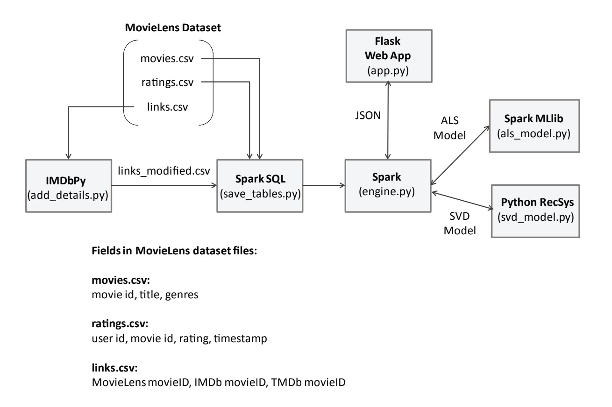

# Abstract
A movie recommendation system that uses both
ALS and SVD based recommendation algorithms. Using Flask for API endpoint, no front-end implemented yet.

The dataset used for
the recommendation system is the MovieLens dataset 

https://grouplens.org/datasets/movielens/


## Architecture for movie recommendation system:



## Installation:
Follow this guide to install Spark:

https://phoenixnap.com/kb/install-spark-on-windows-10

## How to Run:
Set up virtual environment (recommended)

Activate it. If using conda:
```
conda activate <env_name>
```
Run add_details.py first
```
python add_details.py
```

Run save_table.py
```
python save_table.py
```

Run als_model.py
```
python als_model.py
```

Run svd_model.py (broken)

Run app.py

```
python app.py
```

## Troubleshoot: 
Java path need to have no space or it will throw error

Python need to be 32 bit

Choose correct winutils version

Crash while reading csv: https://stackoverflow.com/questions/26954566/apache-spark-pyspark-crash-for-large-dataset


 